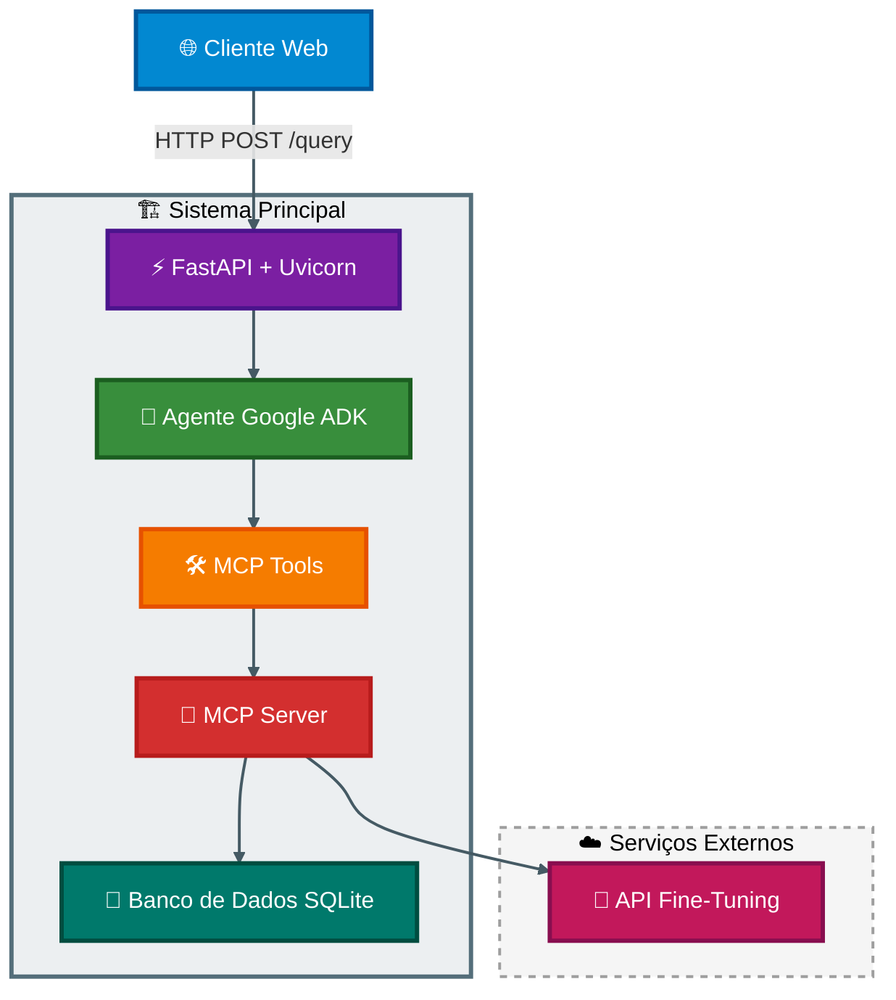
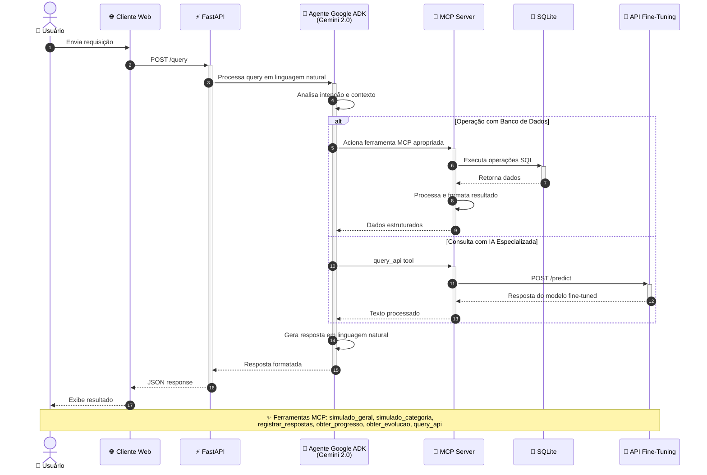

# Sistema de Aprendizado - Legislação de Trânsito

## 📋 Índice
- [🎯 Objetivo](#-objetivo)
- [🚀 Como Executar o Sistema](#-como-executar-o-sistema)
- [🤖 Como Rodar o Fine-Tuning](#-como-rodar-o-fine-tuning)
- [⚙️ Como Configurar MCP Tools](#️-como-configurar-mcp-tools)
- [📚 Exemplos de Uso](#-exemplos-de-uso)
- [🏗️ Explicação da Arquitetura](#️-explicação-da-arquitetura)
- [🔧 Configurações Avançadas](#-configurações-avançadas)
- [📊 Estrutura de Simulados](#-estrutura-de-simulados)
- [🎯 Funcionalidades de Evolução](#-funcionalidades-de-evolução)
- [📞 Suporte](#-suporte)

## 🎯 Objetivo

Sistema completo de aprendizado e simulação para legislação de trânsito brasileira, integrando agentes de IA com banco de dados através do protocolo MCP (Model Context Protocol).

**Funcionalidades Principais:**
- **Simulados inteligentes** com questões categorizadas
- **Acompanhamento de progresso** detalhado por categoria
- **Análise de evolução** do desempenho ao longo do tempo
- **Integração com IA** para explicações e suporte personalizado
- **Sistema de fine-tuning** para respostas especializadas

## 🚀 Como Executar o Sistema

### Pré-requisitos
```bash
# Instalar dependências Python
pip install fastapi uvicorn sqlite3 requests python-dotenv google-genai

# Configurar variáveis de ambiente
cp .env.example .env
# Editar o .env com suas configurações
```

### 🚀 Execução da API Principal

```bash
# Usando uvicorn (desenvolvimento)
uvicorn main:app --reload
```
### Verificar se está funcionando

```bash
# Testar endpoint de saúde
curl http://localhost:8000/

# Resposta esperada:
{"status": "online", "agent": "database_ia_agent"}
```
## 🤖 Como Rodar o Fine-Tuning
### API de Fine-Tuning
O sistema inclui uma API de fine-tuning que pode ser acessada via:

```python
import requests

# Exemplo de chamada para a API de fine-tuning
response = requests.post("https://jade-tachyauxetic-maribel.ngrok-free.dev/predict", 
    json={
        "prompt": "Explique a diferença entre infração leve e grave",
        "max_tokens": 256,
        "temperature": 0.7,
        "top_p": 0.9
    }
)
```
### Configuração do Modelo Fine-Tuned
```python
# Parâmetros atuais do modelo
max_tokens = 256
temperature = 0.7
top_p = 0.9
timeout = 60
```
## ⚙️ Como Configurar MCP Tools
### Estrutura do MCP Server
```python
# Configuração no agente principal
McpToolset(
    connection_params=StdioConnectionParams(
        server_params=StdioServerParameters(
            command="python",
            args=["caminho/para/mcp_server.py"],
        ),
        timeout=30,
    ),
)
```
## ⚙️ Ferramentas MCP Disponíveis

| Ferramenta | Descrição | Parâmetros | Obrigatório |
|------------|-----------|------------|-------------|
| `simulado_geral` | Retorna simulado completo com 30 questões mistas | `user_id` (integer) | ✅ |
| `simulado_categoria` | 10 questões de categoria específica | `category_name` (string) | ✅ |
| `registrar_respostas` | Registra respostas e calcula estatísticas | `user_id` (integer), `respostas` (object) | ✅ |
| `registrar_simulado_categoria` | Salva simulado para análise de evolução | `user_id` (integer), `categoria_name` (string), `respostas` (object) | ✅ |
| `obter_progresso` | Retorna progresso geral do usuário | `user_id` (integer) | ✅ |
| `obter_evolucao` | Análise temporal de desempenho | `user_id` (integer), `categoria_name` (string), `limite` (integer) | ✅ |
| `query_api` | Consulta modelo fine-tuned para explicações | `prompt` (string) | ✅ |

Categorias Disponíveis
- `legislacao` - Legislação geral de trânsito
- `direcao_defensiva` - Direção defensiva
- `primeiros_socorros` - Primeiros socorros
- `meio_ambiente` - Cidadania e meio ambiente
- `mecanica` - Mecânica básica

## 📚 Exemplos de Uso
### 1. Obter Simulado Geral
```python
import requests

response = requests.post("http://localhost:8000/query", 
    json={"query": "Quero fazer um simulado geral para o usuário 123"}
)
```
### 2. Simulado por Categoria
```python
response = requests.post("http://localhost:8000/query",
    json={"query": "Me dê um simulado de direção defensiva"}
)
```
### 3. Registrar Respostas
```python
respostas = {
    "1": "A",
    "2": "B", 
    "3": "C"
}

response = requests.post("http://localhost:8000/query",
    json={"query": f"Registrar minhas respostas {respostas} para o usuário 123"}
)
```
### 4. Ver Progresso
```python
response = requests.post("http://localhost:8000/query",
    json={"query": "Mostre meu progresso geral usuário 123"}
)
```
### 5. Consulta com IA
```python
response = requests.post("http://localhost:8000/query",
    json={"query": "Dê exemplos de infrações graves"}
)
```
## 🏗️ Arquitetura do Sistema

### Diagrama de Fluxo



## Diagrama de Sequência

Componentes do Agente:
- Modelo: Gemini 2.0 Flash para processamento de linguagem
- Sessões: Gerenciamento de estado com InMemorySessionService
- Runner: Execução assíncrona de tasks
- Tools: Conjunto de ferramentas MCP para operações de banco

### MCP Server (Servidor de Ferramentas)
Funcionalidades Principais:

- ✅ Simulados categorizados - Geração de questões por categoria
- ✅ Registro de respostas - Armazenamento e cálculo de estatísticas
- ✅ Progresso do usuário - Acompanhamento individual por categoria
- ✅ Análise de evolução - Tendências e métricas temporais
- ✅ Integração com fine-tuning - Consulta a modelo especializado
- ✅ Logs detalhados - Monitoramento e debug completo

Estrutura do Banco de Dados:

- `categories` - Categorias de questões
- `questions` - Banco de questões com alternativas
- `user_answers` - Histórico de respostas dos usuários
- `user_progress` - Progresso acumulado por categoria
- `simulados_realizados` - Registro completo de simulados

### Fluxo de Processamento
1. Recebimento: Cliente envia query para API FastAPI via endpoint /query
2. Processamento: Agente Google ADK analisa a intenção e contexto
3. Roteamento: Identifica qual ferramenta MCP deve ser acionada
4. Execução: MCP Server processa a requisição no banco de dados
5. Resposta: Retorna resultado formatado para o cliente

## 🔧 Configurações Avançadas
### Variáveis de Ambiente
```python
# API Google GenAI
GOOGLE_API_KEY=your_google_api_key
```
## 📊 Estrutura de Simulados

### 🎯 Simulado Geral (30 questões)

| Categoria | Quantidade | Tópicos Abordados |
|-----------|------------|-------------------|
| **Legislação de Trânsito** | 18 questões | • Infrações e penalidades<br>• Normas de circulação<br>• Sinalização viária<br>• Processo de habilitação<br>• Legislação sobre veículos |
| **Direção Defensiva** | 5 questões | • Prevenção de acidentes<br>• Comportamento seguro |
| **Primeiros Socorros** | 3 questões | • Procedimentos emergenciais<br>• Atendimento pré-hospitalar |
| **Cidadania/Meio Ambiente** | 2 questões | • Educação no trânsito<br>• Preservação ambiental |
| **Mecânica Básica** | 2 questões | • Componentes do veículo<br>• Manutenção preventiva |

### 📝 Simulado por Categoria (10 questões)

**Características:**
- ✅ **Questões aleatórias** da categoria selecionada
- ✅ **Formato padronizado** com alternativas A, B, C, D
- ✅ **Suporte a imagens** (quando disponível nas questões)
- ✅ **Tempo de realização** opcional
- ✅ **Categorias disponíveis:** legislacao, direcao_defensiva, primeiros_socorros, meio_ambiente, mecanica

## 🎯 Funcionalidades de Evolução

### 📈 Sistema de Análise de Desempenho

#### Métricas Calculadas
| Métrica | Descrição |
|---------|-----------|
| **Percentual de acerto** | Geral e por categoria |
| **Total de questões respondidas** | No período analisado |
| **Tempo médio por simulado** | Performance temporal |
| **Evolução temporal do desempenho** | Tendências ao longo do tempo |
| **Identificação de pontos fracos** | Por categoria específica |

## 📞 Suporte
### Canais de Suporte:

📧 Email: caiojuliocesar13@gmail.com

Versão: 3.0
Última atualização: Dezembro 2024
Licença: Apache License 2.0
